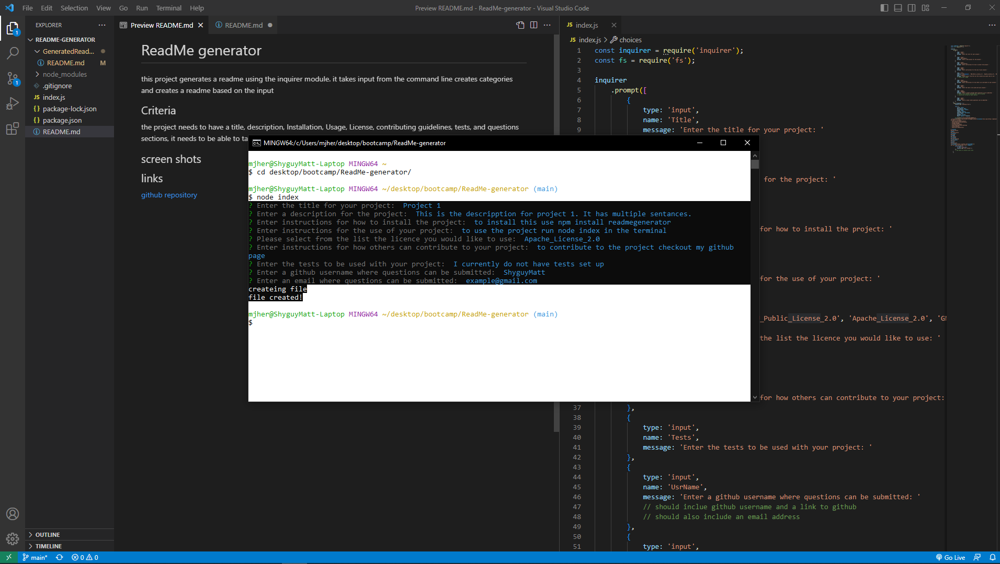
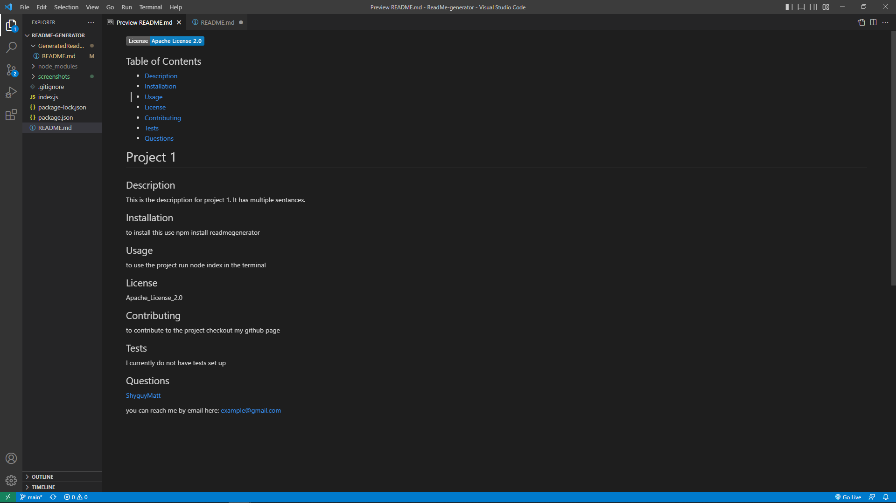

# ReadMe generator

this project generates a readme using the inquirer module. it takes input from the command line
creates categories and creates a readme based on the input

## Criteria
the project needs to have a title, description, Installation, Usage, License, contributing guidelines, tests, and questions sections,
it needs to be able to take input from the user and put it in the correct categories

## screen shots

## Youtube Video

## links
[github repository](https://github.com/shyguyMatt/ReadMe-generator)